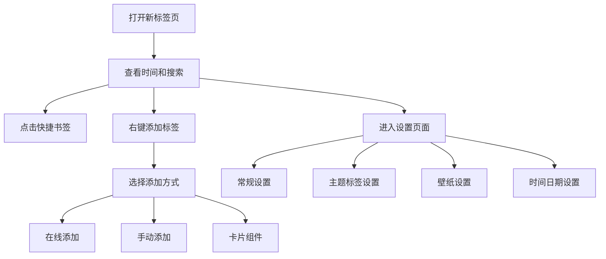

## 1. Product Overview
mTab 是一个功能丰富的浏览器新标签页替代方案，提供美观的界面和多种实用功能。
- 解决用户快速访问常用网站、获取信息和提高工作效率的问题
- 面向需要个性化新标签页体验的用户，提供视觉美观、功能丰富的解决方案

## 2. Core Features

### 2.1 User Roles
| Role | Registration Method | Core Permissions |
|------|---------------------|------------------|
| 游客 | 无需注册 | 使用所有基本功能，数据本地存储 |
| 注册用户 | 邮箱注册 | 同步数据到云端，跨设备访问 |

### 2.2 Feature Module
1. **首页**：时间显示、搜索栏、快捷书签、功能组件、背景壁纸
2. **设置页**：常规设置、主题标签、壁纸设置、时间日期设置
3. **添加标签页**：在线添加、手动添加、卡片组件

### 2.3 Page Details
| Page Name | Module Name | Feature description |
|-----------|-------------|---------------------|
| 首页 | 时间显示 | 实时显示时间、日期（公历+农历）、星期、干支 |
| 首页 | 搜索栏 | 集成多个搜索引擎，支持热搜榜单 |
| 首页 | 快捷书签 | 可自定义的网站导航，支持多种布局尺寸 |
| 首页 | 功能组件 | 热搜、日历、待办事项、AI助手等组件 |
| 首页 | 背景壁纸 | 可更换背景壁纸，支持模糊效果和遮罩透明度调整 |
| 设置页 | 常规设置 | 搜索设置、功能开关等基本配置 |
| 设置页 | 主题标签 | Dock栏设置、侧栏设置、图标字体设置 |
| 设置页 | 壁纸设置 | 壁纸选择、背景模糊、遮罩透明度调整 |
| 设置页 | 时间日期 | 时间显示设置、内容展示选项、字体颜色设置 |
| 添加标签页 | 在线添加 | 从预设库中选择标签和组件 |
| 添加标签页 | 手动添加 | 手动输入标签信息，支持图标和背景颜色自定义 |
| 添加标签页 | 卡片组件 | 添加天气、热搜、电子木鱼、记事本等组件 |

## 3. Core Process
用户打开新标签页 → 查看时间和搜索栏 → 点击快捷书签访问网站 → 可右键添加/编辑标签 → 可点击设置图标进入设置页面 → 可调整壁纸、布局等个性化设置

## 4. User Interface Design
### 4.1 Design Style
- 主色调：蓝色系（#3b82f6）
- 辅助色：白色、浅灰色、橙色（用于强调）
- 按钮样式：圆角设计，填充颜色
- 字体：无衬线字体，主标题 24px，副标题 16px，正文 14px
- 布局风格：卡片式设计，毛玻璃效果，响应式网格布局
- 图标风格：扁平化、线条图标

### 4.2 Page Design Overview
| Page Name | Module Name | UI Elements |
|-----------|-------------|-------------|
| 首页 | 整体布局 | 蓝绿色渐变背景，毛玻璃效果，响应式网格布局 |
| 首页 | 时间显示 | 大字号时间，白色文字，居中显示 |
| 首页 | 搜索栏 | 浅蓝绿色背景，圆角设计，居中位置 |
| 首页 | 快捷书签 | 网格布局，彩色图标背景，悬停效果 |
| 首页 | 功能组件 | 卡片式设计，深色半透明背景 |
| 设置页 | 整体布局 | 左侧导航栏，右侧内容区域，白色背景 |
| 设置页 | 控件 | 开关按钮、滑块、颜色选择器 |
| 添加标签页 | 整体布局 | 弹窗式设计，顶部选项卡，白色背景 |
| 添加标签页 | 表单 | 输入框、按钮、颜色选择器 |

### 4.3 Responsiveness
- 桌面优先设计
- 响应式网格布局，支持不同屏幕尺寸
- 断点设计：移动设备（4列）、平板（6-10列）、桌面（12-16列）
- 触摸设备优化，支持拖拽操作

### 4.4 3D Scene Guidance
- 无 3D 场景需求