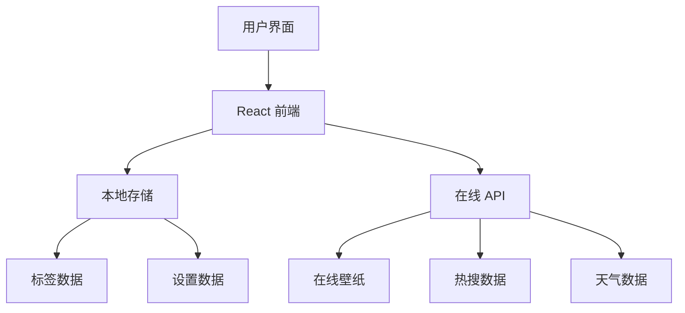

## 1. Architecture Design


## 2. Technology Description
- 前端：React@18 + TypeScript + TailwindCSS@3 + Vite
- 初始化工具：vite-init
- 状态管理：Zustand
- 图标库：Lucide React
- 本地存储：localStorage
- 在线服务：第三方 API（天气、热搜等）

## 3. Route Definitions
| Route | Purpose |
|-------|---------|
| / | 首页（默认新标签页）|
| /settings | 设置页面 |
| /add | 添加标签页面 |

## 4. API Definitions

### 4.1 本地存储 API

#### 标签数据
```typescript
interface Bookmark {
  id: string;
  name: string;
  url: string;
  description?: string;
  icon?: string;
  backgroundColor?: string;
  layout: '1x1' | '1x2' | '2x1' | '2x2' | '2x4';
  category: string;
  createdAt: string;
  updatedAt: string;
}
```

#### 设置数据
```typescript
interface Settings {
  general: {
    searchNewTab: boolean;
    bookmarkNewTab: boolean;
    autoFocusSearch: boolean;
    searchSuggestions: boolean;
    searchHistory: boolean;
    iconSearch: boolean;
  };
  theme: {
    dockBar: 'closed' | 'linked' | 'independent';
    sidebar: boolean;
    sidebarAutoHide: boolean;
    sidebarPosition: 'left' | 'right';
    personalCenterPosition: 'left' | 'right';
    iconSize: number;
    iconRadius: number;
    iconSpacing: number;
    maxColumns: number;
  };
  wallpaper: {
    url: string;
    blur: number;
    opacity: number;
  };
  datetime: {
    showTime: boolean;
    fontColor: string;
    showYearMonth: boolean;
    showSeconds: boolean;
    use24Hour: boolean;
    showWeek: boolean;
    showLunar: boolean;
    showGanZhi: boolean;
  };
}
```

### 4.2 在线 API

#### 天气 API
- 端点：`/api/weather`
- 方法：GET
- 参数：`city` (string)
- 返回：天气数据

#### 热搜 API
- 端点：`/api/hotsearch`
- 方法：GET
- 参数：`source` (string) - 百度、微博等
- 返回：热搜列表

## 5. 前端架构

### 5.1 组件结构
```
src/
├── components/
│   ├── common/
│   │   ├── Button.tsx
│   │   ├── Switch.tsx
│   │   ├── Slider.tsx
│   │   └── ColorPicker.tsx
│   ├── layout/
│   │   ├── Header.tsx
│   │   ├── Sidebar.tsx
│   │   └── DockBar.tsx
│   ├── home/
│   │   ├── TimeDisplay.tsx
│   │   ├── SearchBar.tsx
│   │   ├── BookmarkGrid.tsx
│   │   ├── BookmarkItem.tsx
│   │   └── Widgets.tsx
│   ├── settings/
│   │   ├── GeneralSettings.tsx
│   │   ├── ThemeSettings.tsx
│   │   ├── WallpaperSettings.tsx
│   │   └── DateTimeSettings.tsx
│   └── add-bookmark/
│       ├── OnlineAdd.tsx
│       ├── ManualAdd.tsx
│       └── CardComponents.tsx
├── pages/
│   ├── Home.tsx
│   ├── Settings.tsx
│   └── AddBookmark.tsx
├── stores/
│   ├── bookmarks.ts
│   ├── settings.ts
│   └── ui.ts
├── utils/
│   ├── storage.ts
│   ├── date.ts
│   └── api.ts
└── App.tsx
```

### 5.2 状态管理
使用 Zustand 管理全局状态：
- `bookmarks` store：管理标签数据
- `settings` store：管理用户设置
- `ui` store：管理界面状态（如弹窗显示、当前选中项等）

## 6. 数据模型

### 6.1 本地存储结构

#### 标签数据
```typescript
// localStorage key: 'mtab_bookmarks'
interface BookmarkStorage {
  categories: {
    [categoryId: string]: {
      id: string;
      name: string;
      bookmarks: string[]; // bookmark ids
    };
  };
  bookmarks: {
    [bookmarkId: string]: Bookmark;
  };
}
```

#### 设置数据
```typescript
// localStorage key: 'mtab_settings'
interface SettingsStorage extends Settings {}
```

### 6.2 初始化数据

#### 默认分类
```typescript
const defaultCategories = {
  'category-1': {
    id: 'category-1',
    name: '常用',
    bookmarks: []
  }
};
```

#### 默认设置
```typescript
const defaultSettings: Settings = {
  general: {
    searchNewTab: true,
    bookmarkNewTab: true,
    autoFocusSearch: true,
    searchSuggestions: true,
    searchHistory: false,
    iconSearch: true
  },
  theme: {
    dockBar: 'linked',
    sidebar: true,
    sidebarAutoHide: false,
    sidebarPosition: 'left',
    personalCenterPosition: 'left',
    iconSize: 64,
    iconRadius: 8,
    iconSpacing: 16,
    maxColumns: 8
  },
  wallpaper: {
    url: 'https://example.com/default-wallpaper.jpg',
    blur: 10,
    opacity: 0.7
  },
  datetime: {
    showTime: true,
    fontColor: '#ffffff',
    showYearMonth: true,
    showSeconds: true,
    use24Hour: true,
    showWeek: true,
    showLunar: true,
    showGanZhi: true
  }
};
```

## 7. 技术实现要点

### 7.1 响应式布局
- 使用 TailwindCSS 的响应式类实现不同屏幕尺寸的适配
- 实现 4-16 列的网格布局，根据屏幕宽度自动调整

### 7.2 性能优化
- 组件懒加载
- 防抖和节流处理
- 本地存储缓存
- 图片懒加载

### 7.3 用户体验
- 平滑的动画过渡
- 实时预览设置效果
- 拖拽排序功能
- 右键菜单支持

### 7.4 数据持久化
- 使用 localStorage 存储用户数据
- 定期自动保存
- 支持导入/导出功能